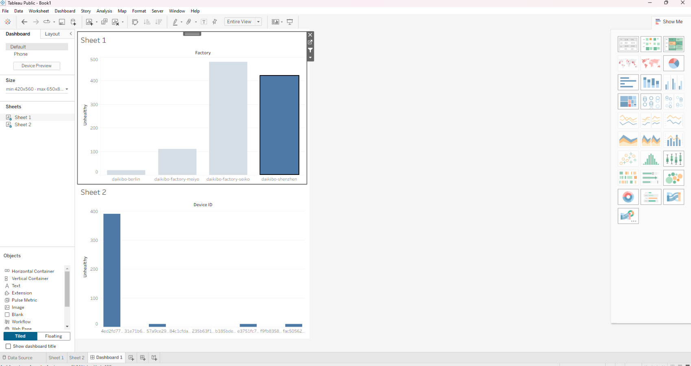

# 📊 Deloitte Australia Data Analytics Job Simulation (Forage)

## Overview
This project is part of the Deloitte Australia Data Analytics job simulation completed on Forage.  
It focuses on data analysis, visualization, and deriving business insights using Excel and Tableau in a consulting-style scenario.

---

## 🎯 Objectives
- Analyze and classify datasets using Excel  
- Create meaningful visualizations using Tableau  
- Extract insights to support business decision-making  

---

## 🛠 Tools & Technologies Used
- Microsoft Excel  
- Tableau  
- Data Cleaning & Classification Techniques  
- Data Visualization  

---

## 📈 Project Tasks
- Performed data cleaning and structured raw datasets in Excel  
- Applied classification techniques to organize and interpret data  
- Built an interactive Tableau dashboard for visualization  
- Derived insights to simulate real-world business decision-making  

---

## 📊 Dashboard Preview

This dashboard was created using Tableau to visualize key business metrics and support data-driven insights.

---

## 📌 Key Learnings
- Understanding how data is used in consulting environments  
- Building dashboards for storytelling with data  
- Converting raw data into actionable insights  
- Strengthening Excel and Tableau skills  
